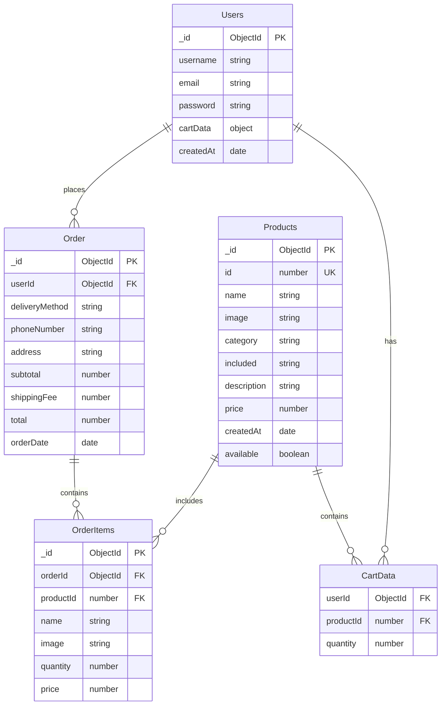

# Crochet n' Beads Database Design

```mermaid
erDiagram
    Users ||--o{ Order : places
    Users ||--o{ CartData : has
    Products ||--o{ CartData : contains
    Products ||--o{ OrderItems : includes
    Order ||--o{ OrderItems : contains

    Users {
        _id ObjectId PK
        username string 
        email string 
        password string 
        cartData object 
        createdAt date 
    }

    Products {
        _id ObjectId PK
        id number UK
        name string 
        image string 
        category string 
        included string 
        description string 
        price number 
        createdAt date 
        available boolean 
    }

    Order {
        _id ObjectId PK
        userId ObjectId FK
        deliveryMethod string
        phoneNumber string
        address string
        subtotal number
        shippingFee number
        total number
        orderDate date
    }

    OrderItems {
        _id ObjectId PK
        orderId ObjectId FK
        productId number FK
        name string 
        image string 
        quantity number 
        price number 
    }

    CartData {
        userId ObjectId FK
        productId number FK
        quantity number 
    }
```